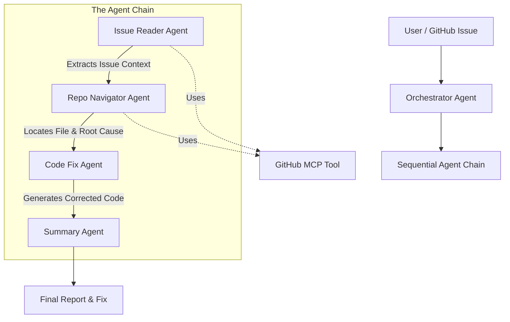

# GitHub Agent 🤖🛠️

> **Automating the Loop: From Issue to Fix with Agentic AI**

## 1. The Pitch 🚀

### The Problem
Software maintenance is the silent killer of developer productivity. Studies show that developers spend **40-80% of their time** reading code, debugging, and maintaining existing systems rather than building new features. The cognitive load of context switching—jumping from a GitHub issue to the codebase, locating the relevant files, reproducing the state, and crafting a fix—is immense.

### The Solution
**GitHub Agent** is an autonomous AI teammate designed to close the loop on software bugs. It doesn't just chat about code; it **acts**. By integrating directly with your GitHub repository, it reads issues, navigates the codebase to pinpoint the root cause, and generates precise, context-aware code fixes—all without human intervention until the final review.

### The Value
*   **Drastic Reduction in MTTR (Mean Time To Repair):** Instant analysis and fix generation.
*   **Focus on Innovation:** Frees up developers from routine bug fixing to focus on high-value architecture and feature work.
*   **Context-Aware:** Unlike generic coding assistants, it understands the specific context of *your* repository and the reported issue.

---

## 2. Core Concept & Value 💡

The central idea of **GitHub Agent** is **"Agentic Code Maintenance"**. It moves beyond simple code completion to full-cycle problem solving.

*   **Agentic Workflow:** It's not a chatbot; it's a system of specialized agents working in a chain.
*   **Innovation:** We leverage the **Model Context Protocol (MCP)** to give our agents safe, read-only access to the repository structure, allowing them to "see" the project like a developer does.
*   **Relevance:** In the era of Generative AI, the next frontier is agents that can perform end-to-end tasks. This project demonstrates a practical, high-impact application of agentic workflows in the software development lifecycle (SDLC).

---

## 3. Architecture & Journey 🗺️

### The Journey
Our journey began with a simple question: *"Can an AI agent fix a bug just by reading the GitHub issue?"*
We started with a single prompt, but quickly realized that a monolithic approach failed at complex navigation. We evolved into a **multi-agent architecture**, mimicking how a human developer thinks:
1.  **Understand:** Read the issue.
2.  **Locate:** Find the code.
3.  **Fix:** Edit the code.
4.  **Report:** Summarize the changes.

### Architecture Diagram



---

## 4. Implementation (Architecture & Code) 🏗️

The project is built on the **Google Agent Development Kit (ADK)**, leveraging the power of **Gemini 2.5 Flash Lite** for high-speed, cost-effective reasoning.

### Key Components:
*   **Orchestrator Agent:** The entry point that manages user sessions and delegates tasks.
*   **Issue Reader Agent:** Specialized in parsing GitHub issues, extracting key details (error messages, stack traces) and filtering noise.
*   **Repo Navigator Agent:** The "explorer". It uses semantic understanding to map the issue description to specific files and functions in the codebase.
*   **Code Fix Agent:** The "engineer". It takes the located code and the issue context to generate a surgical fix, ensuring the rest of the file remains untouched.
*   **Summary Agent:** The "communicator". Generates a human-readable Markdown report explaining the diagnosis and the solution.

### AI Integration
We use **Gemini 2.5 Flash Lite** as the brain. Its large context window allows us to feed entire file contents and issue threads, enabling the model to understand deep dependencies.

---

## 5. Technical Implementation ⚙️

*   **Framework:** Python, Google ADK (`google-adk`)
*   **LLM:** Google Gemini 2.5 Flash Lite
*   **Tools:** `github-mcp` (Model Context Protocol) for standardized tool interfaces.
*   **State Management:** `InMemorySessionService` to pass context (Issue -> File -> Fix) between agents in the chain.
*   **Safety:** The agent is designed with **Read-Only** access for the exploration phase. It generates the fix as a suggestion (output) rather than directly committing to the repo, ensuring human-in-the-loop verification.

---

## 6. Documentation & Setup 📚

### Prerequisites
*   Python 3.12+
*   A GitHub Personal Access Token
*   Google GenAI API Key

### Installation

1.  **Clone the repository:**
    ```bash
    git clone https://github.com/GamerQuanTuM/Github-Agent
    cd capstone
    ```

2.  **Install dependencies:**
    ```bash
    pip install -e .
    ```
    *Or using uv:*
    ```bash
    uv sync
    ```

3.  **Configure Environment:**
    Create a `.env` file in the root directory:
    ```env
    GOOGLE_API_KEY=your_gemini_api_key
    GITHUB_PERSONAL_ACCESS_TOKEN=your_github_token
    ```

### Usage

Run the agent:
```bash
python -m github_agent.agent
```

**Example Interaction:**
```text
You: Check issue #42 in repo my-org/my-repo
Agent: 
... [Internal Monologue: Reading Issue] ...
... [Internal Monologue: Navigating Repo] ...
... [Internal Monologue: Generating Fix] ...

📝 Issue Resolution Report
...
```

### Directory Structure
*   `github_agent/agent.py`: Main entry point and agent definitions.
*   `github_agent/system_prompts/`: System instructions for each specialized agent.
*   `github_agent/tools/`: Tool definitions (MCP integration).
*   `github_agent/schemas/`: Data models for agent communication.
